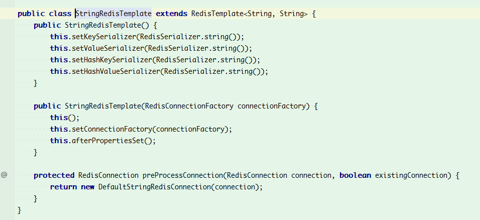

# Redis 简介

在后面 springboot 整合 redis 的时候会用到连接池，所以这里先来介绍下 Redis中的连接池:

> **客户端连接 Redis 使用的是 TCP协议，直连的方式每次需要建立 TCP连接，而连接池的方式是可以预先初始化好客户端连接，所以每次只需要从 连接池借用即可**，而借用和归还操作是在本地进行的，只有少量的并发同步开销，远远小于新建TCP连接的开销。另外，直连的方式无法限制 redis客户端对象的个数，在极端情况下可能会造成连接泄漏，而连接池的形式可以有效的保护和控制资源的使用。

下面以Jedis客户端为例，再来总结下 客户端直连方式和连接池方式的对比

|        | 优点                                                         | 缺点                                                         |
| ------ | ------------------------------------------------------------ | ------------------------------------------------------------ |
| 直连   | 简单方便，适用于少量长期连接的场景                           | 1. 存在每次新建/关闭TCP连接开销 2. 资源无法控制，极端情况下出现连接泄漏 3. Jedis对象线程不安全(Lettuce对象是线程安全的) |
| 连接池 | 1. 无需每次连接生成Jedis对象，降低开销 2. 使用连接池的形式保护和控制资源的使用 | 相对于直连，使用更加麻烦，尤其在资源的管理上需要很多参数来保证，一旦规划不合理也会出现问题 |

。Lettuce 和 jedis 的都是连接 Redis Server的客户端，Jedis 在实现上是直连 redis server，多线程环境下非线程安全，除非使用连接池，为每个 redis实例增加 物理连接。


Lettuce 是 一种可伸缩，线程安全，完全非阻塞的Redis客户端，多个线程可以共享一个RedisConnection,它利用Netty NIO 框架来高效地管理多个连接，从而提供了异步和同步数据访问方式，用于构建非阻塞的反应性应用程序。

**在 springboot 1.5.x版本的默认的Redis客户端是 Jedis实现的，springboot 2.x版本中默认客户端是用 lettuce实现的。**

下面介绍 `springboot 2.0`分别使用 `jedis`和 `lettuce`集成 redis服务

# springboot 2.0 通过 lettuce集成Redis服务

## 导入依赖

```xml
<dependencies>
        <dependency>
            <groupId>org.springframework.boot</groupId>
            <artifactId>spring-boot-starter</artifactId>
        </dependency>
        <dependency>
            <groupId>org.springframework.boot</groupId>
            <artifactId>spring-boot-starter-web</artifactId>
        </dependency>
       <!--redis 访问启动器 -->
       <dependency>
           <groupId>org.springframework.boot</groupId>
           <artifactId>spring-boot-starter-data-redis</artifactId>
       </dependency>
       <!--redis客户端Lettuce 数据库连接池依赖 -->
       <dependency>
           <groupId>org.apache.commons</groupId>
           <artifactId>commons-pool2</artifactId>
       </dependency>
    	
        <dependency>
            <groupId>org.springframework.boot</groupId>
            <artifactId>spring-boot-starter-test</artifactId>
            <scope>test</scope>
        </dependency>
    </dependencies>
```

## application.yml配置文件

```yml
spring:
  redis:
    host: localhost # 默认localhost，可以不用配置
    port: 6379      # 默认6379，可以不用配置
    database: 0    # 默认第0个数据库，可以不用配置
    password: pass4redis#123
    lettuce:
      pool:
        max-active: 8    # 连接池最大连接数(使用负值表示没有限制) 默认为8
        min-idle: 0      # 连接池中的最小空闲连接 默认为 0
        max-idle: 8      # 连接池中的最大空闲连接 默认为8
        max-wait: -1ms   # 连接池最大阻塞等待时间(使用负值表示没有限制) 默认为-1
```

## 自定义 RedisTemplate

默认情况下的模板只能支持 `RedisTemplate<String,String>`，只能存入字符串，很多时候，我们需要自定义 RedisTemplate ，设置序列化器，这样我们可以很方便的操作实例对象。如下所示：

```java
@Configuration
public class RedisConfig {
    @Bean
    public RedisTemplate<String, Serializable> redisTemplate(LettuceConnectionFactory connectionFactory) {
        RedisTemplate<String, Serializable> redisTemplate = new RedisTemplate<>();
        redisTemplate.setKeySerializer(new StringRedisSerializer());
        redisTemplate.setValueSerializer(new GenericJackson2JsonRedisSerializer());
        redisTemplate.setConnectionFactory(connectionFactory);
        return redisTemplate;
    }
}
```

## 定义测试实体类

```java
public class User implements Serializable {
    private static final long serialVersionUID = 4220515347228129741L;
    private Integer id;
    private String username;
    private Integer age;

    public User(Integer id, String username, Integer age) {
        this.id = id;
        this.username = username;
        this.age = age;
    }

    public User() {
    }
    //getter/setter 省略
}
```

## 测试

```java
@RunWith(SpringRunner.class)
@SpringBootTest
public class RedisTest {
    private Logger logger = LoggerFactory.getLogger(RedisTest.class);
    @Autowired
    private RedisTemplate<String, Serializable> redisTemplate;

    @Test
    public void test() {
        String key = "user:1";
        redisTemplate.opsForValue().set(key, new User(1,"pjmike",20));
        User user = (User) redisTemplate.opsForValue().get(key);
        logger.info("uesr: "+user.toString());
    }
}
```
# StringRedisTemplate和RedisTemplate的区别及使用方法

首先如下图所示**StringRedisTemplate继承了RedisTemplate,所以两者对Redis的操作方法具有相同之处**



- 两者的数据是**不共通**的；也就是说StringRedisTemplate只能管理StringRedisTemplate里面的数据，RedisTemplate只能管理RedisTemplate中的数据。
- 其实他们两者之间的区别主要在于他们使用的序列化类:

　　　　RedisTemplate使用的是JdkSerializationRedisSerializer    存入数据会将数据先序列化成字节数组然后在存入Redis数据库。 

　　 　  StringRedisTemplate使用的是StringRedisSerializer

- 使用时注意事项：

　　　当你的redis数据库里面本来存的是字符串数据或者你要存取的数据就是字符串类型数据的时候，那么你就使用StringRedisTemplate即可。

　　　但是如果你的数据是复杂的对象类型，而取出的时候又不想做任何的数据转换，直接从Redis里面取出一个对象，那么使用RedisTemplate是更好的选择。

- RedisTemplate使用时常见问题：

　　　　redisTemplate 中存取数据都是字节数组。当redis中存入的数据是可读形式而非字节数组时，使用redisTemplate取值的时候会无法获取导出数据，获得的值为null。可以使用 StringRedisTemplate 试试。

